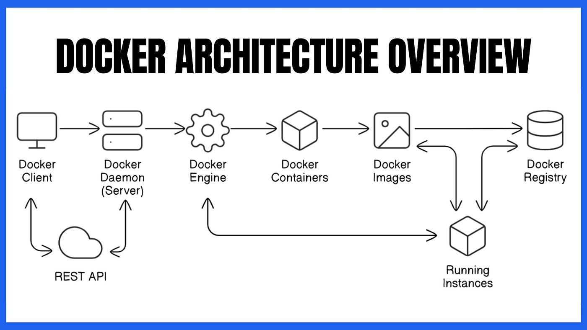

# Day 1

## Info - Hypervisor Overview
<pre>
- is nothing but virtualization technology
- with virtualization technology, we can run multiple OS within virtual machines on the same laptop/desktop/workstation/server
- i.e many OS can actively run side by side
- there are 2 types of Hypervisors
  
  1. Type 1 (a.k.a Bare Metal Hypervisor)
  - this type of Hypervisor will be installed on the server directly without any OS
  - Hypervisor itself supports a minimal OS 
  - meant to be used by Workstations & Servers
  - examples
    - KVM
    - Microsoft Hyper-V
    - VMWare vSphere/vCenter
  
  2. Type 2 (a.k.a Hosted Hypervisor)
  - can only be installed on top of some Host OS ( Windows, Linux or Mac OS-X )
  - meant to be used by Laptops/Desktops and Workstations
  - examples
    - Oracle VirtualBox ( Windows, Linux & Mac OS-X )
    - VMWare Workstation ( Windows & Linux )
    - VMWare Fusion ( Mac OS-X )
    - Parallels ( Mac OS-X )

- this type of Virtualization is considered heavy-weight virtualization
- the reason being, for each Virtual Machine, we need to allocate dedicated Hardware resources
  - CPU Cores
  - RAM
  - Storage (HDD/SDD)
</pre>

## Info - Hypervisor High-Level Architecture


## Info - Container Technology
<pre>
- is an application virtualization technology
- each application runs in a separate container
- each container uses about 8 namespaces
- container are nothing but application process that runs in a separate namespace
- all containers that runs on the same machines, share the OS Kernel and Hardware resources on the
  underlying Host OS
- as containers doesn't expect dedicated hardware resources, this type of virtualization is considered
  light weight virtualization
- in Linux Kernel that supports containers
  - namespace and
    - helps us isolate one container from the other
  - CGroups ( Control group )
    - helps us apply resource quota restrictions on the container leve
    - example
      - we can restrict how much CPU a particular container can utilize at the max
      - we can restrict how much RAM a particular container can utilize at the max
</pre>

## Info - Container Runtime
<pre>
- is a low-level software, that helps us manage containers and container images
- container runtimes, depends on the Linux Kernel namespaces, Control Groups to supports containers
- it is not so user-friendly, hence they are not used by end-users like us
- examples
  - runC 
  - cRun
  - CRI-O
</pre>

## Info - Container Engine
<pre>
- is a high-level software, that helps us manage containers and container images
- container engines, depends on Container Runtimes to manage containers and container images
- it is very user-friendly, hence almost all end-users only are aware of Container Engines
- examples
  - Docker 
    - depends on containerd, which in turn depends on runC Container runtime
  - Podman
    - depends on CRI-O container runtime
  - Containerd
    - depends on runC container runtime
</pre>

## Info - Docker Overview
<pre>
- Docker Container Engine is developed in Golang by a company called Docker Inc
- Docker comes in 2 flavours
  1. Docker Community Edition - Docker CE ( opensource )
  2. Docker Enteprise Edition - Docker EE ( commercial product that comes with Support )
- Docker follows Client/Server Architecture
- Client tool is docker
- The Server is dockerd, that runs as a service in the background
</pre>

## Info - Docker High-Level Architecture



## Info - Docker Image
<pre>
- is a JSON file that refers one to many Docker Image Layers
- is a blueprint/specification of containers
- all the necessary software tools that are required to run an application are bundled as part of the Docker Image
- this is similar to Window12OS.iso, RHEL-os.iso
- with a Docker Image, we can create any number of containers
- application + all dependent libraries + any dependencies => bundled => docker image
- each image will have one or more image layers
- image layers can be shared by multiple images
</pre>


## Info - Linux Namespaces
<pre>
- Linux supports a total of 8 types of namespaces
- mnt
  - useful to mount multiple folders as filesystem
- pid
  - a process may have a unique PID system-wide and a different pid within the namespace as 1
- net
  - isolates network stack
  - ip addresses
  - ports
  - routing tables
- ipc
  - message queues
  - mutex, semphares, etc
- uts
  - hostname
  - domain names, etc
- user
  - isolates users and groups
  - rootless containers use this namespace
- cgroup
  - virtualizes /proc/self/cgroup
  - containers only see their cgroup hierarchy
- time
  - useful for checkpoint/restore containers
  - system clock
</pre>

## Info - Docker Container
<pre>
- is a running instance of a Docker image
- in order to create a Docker container, the respective Docker image must be present in the local docker registry
- typically in Linux, local registry folder will be /var/EXPOSE 80lib/docker
- each container represents a single application process
- each container has its own network namespace
- each container has its own pid namespace
- each container has its own mnt namespace
- each container has its own uts, ipc, user and cgroup namespaces
</pre>

## Info - Docker Registry
<pre>
- is a collection of many Docker images
- there are 3 types of Docker Registry
  1. Local Docker Registry
     - /var/lib/docker folder
  2. Private Docker Registry ( optional )
     - can be setup using Sonatype Nexus or JFrog Artifactory
  3. Remote Docker Registry 
     - it is a website maintained by Docker Inc organization that supports the Docker Engine
     - it uses a Server similar to Sonatype Nexus or JFrog Artifactory
</pre>

## Info - Installing Docker CE in Ubuntu
```
# Add Docker's official GPG key:
sudo apt update
sudo apt install ca-certificates curl
sudo install -m 0755 -d /etc/apt/keyrings
sudo curl -fsSL https://download.docker.com/linux/ubuntu/gpg -o /etc/apt/keyrings/docker.asc
sudo chmod a+r /etc/apt/keyrings/docker.asc

# Add the repository to Apt sources:
sudo tee /etc/apt/sources.list.d/docker.sources <<EOF
Types: deb
URIs: https://download.docker.com/linux/ubuntu
Suites: $(. /etc/os-release && echo "${UBUNTU_CODENAME:-$VERSION_CODENAME}")
Components: stable
Signed-By: /etc/apt/keyrings/docker.asc
EOF

sudo apt update

sudo apt install docker-ce docker-ce-cli containerd.io docker-buildx-plugin docker-compose-plugin -y
sudo usermod -aG docker $USER
su $USER
docker --version
docker images
```

## Lab - Troubleshooting Docker permission denied error
When it prompts for password, type 'palmeto@123' without quotes. This commands forces a re login of your
currenly logged in user to learn the newly joined user groups.

```
id
su $USER
id
```

## Lab - Finding more details info about your docker installation
```
docker info
```


## Lab - Listing the docker images from your local docker registry
```
docker images
```


## Lab - Downloading docker image from Docker Hub Remote Registry to Local Docker Registry
```
docker images
docker pull ubuntu:22.04
docker images
```


## Lab - Deleting a docker image from local docker registry
```
docker images
docker pull hello-world:latest
docker images

docker rmi hello-world:latest
```


## Lab - Creating a container in background(daemon) mode
```

# Creating container and running it in background
docker run -dit --name ubuntu1-jegan --hostname ubuntu1-jegan ubuntu:latest /bin/bash
docker run -dit --name ubuntu2-jegan --hostname ubuntu2-jegan ubuntu:latest /bin/bash
docker run -dit --name ubuntu3-jegan --hostname ubuntu3-jegan ubuntu:latest /bin/bash

# List all currently running containers
docker ps
```

Note
<pre>
run - will create and start the container
dit - deattached interactive terminal
name - is used on the docker level to manage docker containers
hostname - is used on the OS level as an alternate to IP addresses
ubuntu:latest - docker image with which we would like to create a container 
/bin/bash - we would like run a bash terminal as the default application once the container starts running
</pre>


## Lab - Stopping container

Stopping a single container
```
docker stop ubuntu1-jegan
```

Stopping multiple containers
```
docker stop ubuntu2-jegan ubuntu3-jegan
```

Stopping multiple containers without calling out their names
```
docker stop $(docker ps -q -f --name="ubuntu.*-jegan")
```

Stopping every containers
```
docker stop $(docker ps -q)
```

## Lab - Starting container
Starting a single exited container
```
docker start ubuntu1-jegan
```

Starting multiple exited containers
```
docker start ubuntu2-jegan ubuntu3-jegan
```

Starting multiple containers without their names
```
docker start $(docker ps -aq)
```


## Lab - Restarting container

Restart a container to force apply any config changes 
```
docker restart ubuntu1-jegan
```

Restart multiple containers
```
docker restart ubuntu1-jegan ubuntu2-jegan ubuntu3-jegan
```

Restart all containers
```
docker restart $(docker ps -q)
```

## Lab - Deleting containers

Delete a single running container gracefuly
```
docker stop ubuntu1-jegan
docker rm ubuntu1-jegan
docker ps
```

Delete multiple containers
```
docker stop ubuntu1-jegan ubuntu2-jegan ubuntu3-jegan && docker rm ubuntu1-jegan ubuntu2-jegan ubuntu3-jegan
```

Delete multiple containers forcibly ( You will end up deleting containers created by others too so think twice )
```
docker rm -f $(docker ps -aq)
```

## Lab - Create a container and start it later on-demand
```
docker create -it --name ubuntu1-jegan --hostname ubuntu1-jegan ubuntu:latest /bin/bash

# The below command won't show the ubuntu1-jegan container as it is not running
docker ps | grep jegan

#Start the container manually
docker start ubuntu1-jegan

#List and see the container in running state now
docker ps | grep jegan
```


## Lab - Finding container details
```
docker inspect ubuntu1-jegan
```


## Lab - Retrieving IP address of a docker container
```
docker inspect ubuntu1-jegan | grep IPA

docker inspect -f {{.NetworkSettings.Networks.bridge.IPAddress}} ubuntu1-jegan
```


## Lab - Getting inside a container shell
```
docker ps | grep ubuntu1-jegan
docker exec -it ubuntu1-jegan /bin/bash

hostname
hostname -i

ifconfig

apt update && apt install -y net-tools iputils-ping

ifconfig
ping 8.8.8.8

exit
```


## Lab - Creating a container in the foreground(interactive) mode
```
docker run -it --name ubuntu2-jegan --hostname ubuntu2-jegan ubuntu:latest /bin/bash
hostname
hostname -i
ls
exit
docker ps
```


## Lab - Setting up a Load Balancer with nginx

We are going to create a load-balancer setup something like below


Let's create 3 web server containers using nginx:latest image from Docker Hub Remote Registry
```
docker run -d --name nginx1-jegan --hostname nginx1-jegan nginx:latest
docker run -d --name nginx2-jegan --hostname nginx2-jegan nginx:latest
docker run -d --name nginx3-jegan --hostname nginx3-jegan nginx:latest
```

List and see if the above containers are running as expected
```
docker ps | grep jegan
```

Let's create the loadbalancer container
```
docker run -d --name lb-jegan --hostname lb-jegan -p 8080:80 nginx:latest
```
In the above command, the port 8080 represents the lab server port, the right side 80 represents on which port nginx web server is listening inside the container.  Hence, we can only change the port 8080 to some other available port on the lab server.

List and see if all 4 containers are running
```
docker ps | grep jegan
```


At this point, nginx1-jegan,nginx2-jegan, nginx3-jegan and lb-jegan containers works as a web server by default.
We need to configure the lb-jegan container to force it work as a Load Balancer.

Let's find the IP Addresses of all web servers before configure lb container
```
docker inspect nginx1-jegan | grep IPA
docker inspect nginx2-jegan | grep IPA
docker inspect -f {{.NetworkSettings.Networks.bridge.IPAddress}} nginx3-jegan
docker exec -it lb-jegan hostname -i
```

